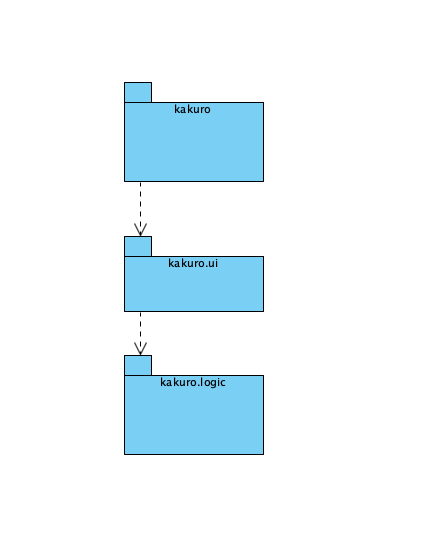
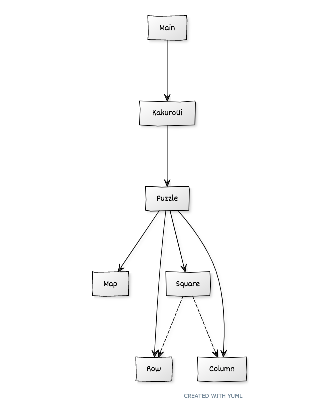

# Arkkitehtuurikuvaus

## Rakenne

Ohjelman koodin pakkausrakenne on seuraava:

Pakkaus _todoapp.ui_ sisältää JavaFX:llä toteutetun käyttöliittymän _todoapp.domain_ sovelluslogiikan ja _todoapp.dao_ tietojen pysyväistallennuksesta vastaavan koodin.

## Käyttöliittymä

Käyttöliittymä on rakennettu ohjelmallisesti luokassa [kakuro.ui.KakuroUi .  Käyttöliittymä on toistaiseksi tekstikäyttöliittymä, mutta toteutetaan jatkossa JavaFX-kirjaston avulla graafisena käyttöliittymänä.

Käyttöliittymä on pyritty eristämään täysin sovelluslogiikasta, se ainoastaan kutsuu sopivin parametrein sovelluslogiikan toteuttavan _Puzzle_-luokan olion _puzzle_ metodeja.

## Sovelluslogiikka

Sovelluksen loogisen datamallin muodostavat luokat _Puzzle_, _Square_, _Row_, _Column_ ja _Map_.  

Käyttöliittymästä kutsutaan vain _Puzzle_-luokan metodeja.  _Puzzle_-luokasta kutsutaan _Map_- ja _Square_-luokan metodeja.  _Square_-luokasta kutsutaan _Row_- ja _Column_-luokan metodeja.
