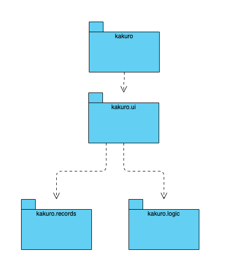
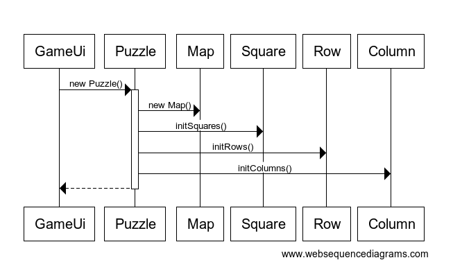

# Arkkitehtuurikuvaus

## Rakenne

Ohjelman koodin pakkausrakenne on seuraava:

Pakkaus _kakuro.ui_ sisältää JavaFX:llä toteutetun käyttöliittymän ja _kakuro.logic_ sovelluslogiikan.

## Käyttöliittymä

Käyttöliittymä on rakennettu ohjelmallisesti luokassa _kakuro.ui.GameUi_ .  Käyttöliittymä on toteutettu JavaFX-kirjaston avulla graafisena käyttöliittymänä.

Käyttöliittymä on pyritty eristämään täysin sovelluslogiikasta.  Se kutsuu ainoastaan sovelluslogiikan toteuttavan _Puzzle_-luokan metodeja.

## Sovelluslogiikka

Sovelluksen logiikka on rakennettu ohjelmallisesti kakuro.logic -pakkauksen luokissa _Puzzle_,  _Map_, _Square_, _Row_  ja  _Column_.

Sovelluksen looginen luokkarakenne on kuvatttu alla.  

Sovelluksen loogisen rakenteen luiominen tapahtuu seuraavasti:

- Käyttöliittymä luo Puzzle-luokan olion, joka kuvaa Kakuro-ristikkoa.
- Puzzle-luokka luo Map-luokan olion, joka lukee tiedostosta Kakuro-ristikon tekstimuodossa
-  Map-luokan tekstipohjaisen kartan perusteella luodaan Square-luokan oliot, jotka kuvaavat Kakuro-ristikon täytettäviä ruutuja.
- Square-luokan oliot käydään läpi ja niiden perusteella luodaan Row-luokan oliot, jotka kuvaavat ristikon vaakarivejä.
- Samalla lailla luodaan Column-luokan oliot, jotka kuvaavat pystyrivejä.

Sovelluksen looginen toiminta pelin aikana tapahtuu seuraavasti:

- Käyttäjä valisee ruudun, johon seuraava numero asetetaan.
- Käyttäjä antaa ruutuun tulevan numeron graafisen käyttöliittymän tai näppäimistön välityksellä.
- Puzzle-luokan olio kutsuu kyseisen ruudun Square-luokan metodia setNumber() , joka asettaa ruudun numeroksi valitun numeron.
- Square-luokan olio kutsuu vaakariviä kuvaavan Row-luokan metodia changeNumber(), jolla päivitetään rivin tietoihin uusi numero.
- changeNumber()-metodi kutsuu metodeja checkSum() ja checkSame(), jotka tarkistavat, täyttääkö uusi numero rivin ehdot (oikea summa, sama lukua ei kahdesti).
- Samalla lailla päivitetään ja tarkistetaan pystyrivi Column-luokan metodeilla
- Mahdollinen virhe palautetaan Square-luokan oliolle, Puzzle-luokan oliolle ja lopulta käyttöliittymälle.
- Käyttöliittymä piirtää uuden numeron grafiikan vihreänä, jos luku kelpaa ja punaisena, jos luku ei täytä vaaka- tai pystyrivin ehtoja.
