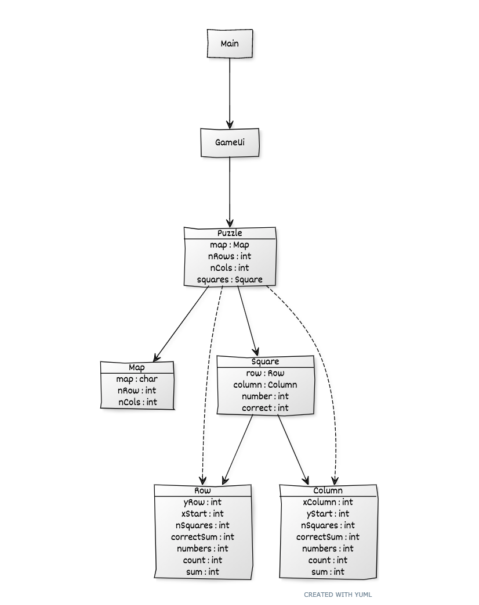

# Arkkitehtuurikuvaus

## Rakenne

Ohjelman koodin pakkausrakenne on seuraava:

Pakkaus _kakuro.ui_ sisältää JavaFX:llä toteutetun käyttöliittymän ja _kakuro.logic_ sovelluslogiikan.

## Käyttöliittymä

Käyttöliittymä on rakennettu ohjelmallisesti luokassa _kakuro.ui.Gameboard_ .  Käyttöliittymä on toteutettu JavaFX-kirjaston avulla graafisena käyttöliittymänä.

Käyttöliittymä on pyritty eristämään täysin sovelluslogiikasta, se ainoastaan kutsuu sovelluslogiikan toteuttavan _Puzzle_-luokan olion _puzzle_ metodeja.

## Sovelluslogiikka

Sovelluksen loogisen datamallin muodostavat luokat _Gameboard_,_Puzzle_, _Square_, _Row_, _Column_ ja _Map_.

