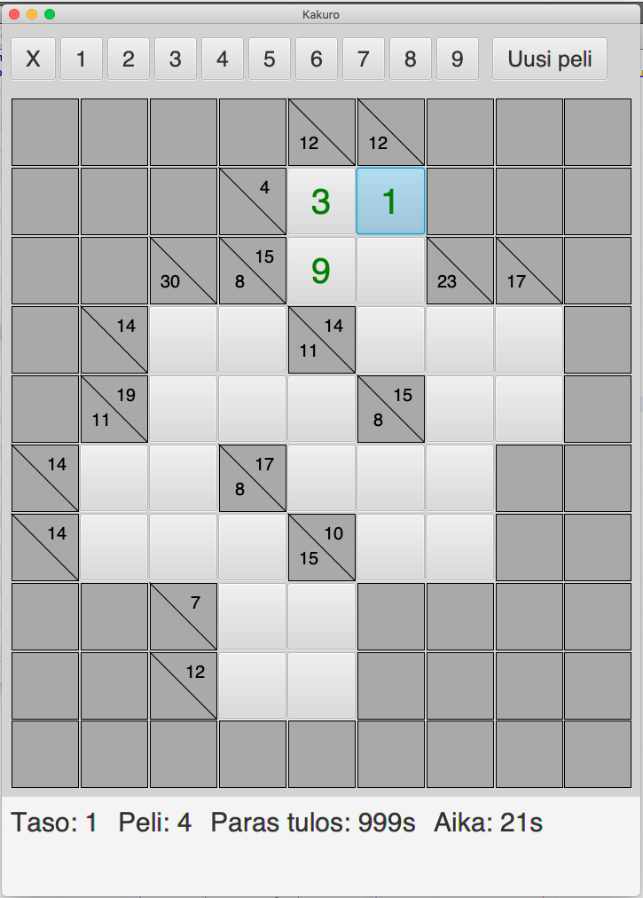
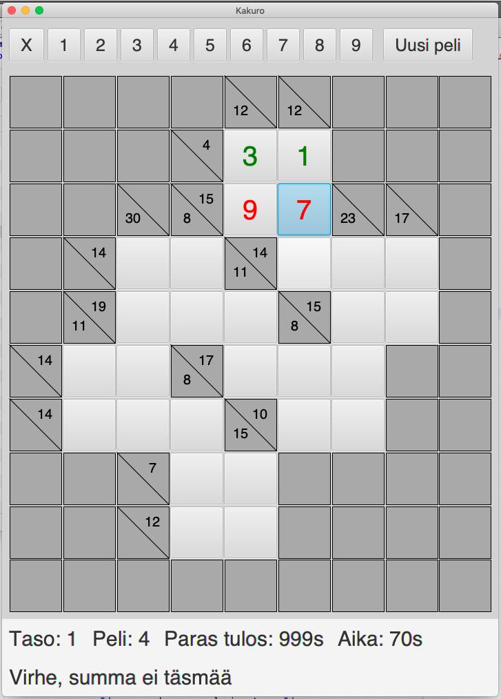
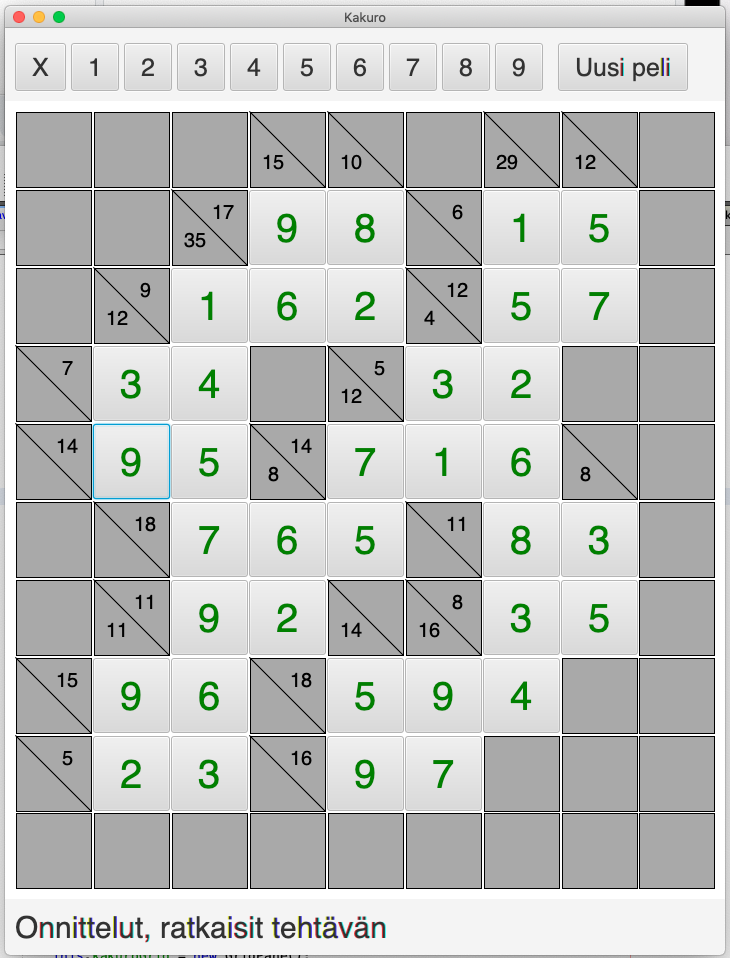

# Käyttöohje

Lataa ohjelma [kakuro.jar](https://github.com/lautanal/ot-harjoitustyo/releases/tag/Viikko6) sekä puzzle-kansio, jossa on pelikentät.

## Ohjelman käynnistäminen

Ohjelma käynnistetään komennolla 

```
java -jar kakuro.jar
```

## Käyttöliittymä

Sovellusta käytetään JavaFX:llä luodun käyttöliittymän avulla :





Kakuro-ruudukossa on tyhjiä ruutuja, jotka täytetään käyttäen numeroita 1-9.  Samassa kentässä vaaka- tai pystyrivillä ei saa olla kahta samaa numeroa. Vaaka- ja pystyrivien lukujen tulee toteuttaa summa, joka on merkitty ruudukkoon.

Sovellusikkunan keskellä on varsinainen Kakuro-ruudukko.   Kakuro-ruudukon yläpuolella on numeroiden valintarivi ja alhaalla on info-tekstin alue.

Käyttäjä valitsee jonkin Kakuro-ruudukon ruuduista hiirellä näpäyttämällä.   Sen jälkeen hän syöttää kyseiseen ruutuun sopivan luvun.  Luvun voi valita yläreunan numerorivistä tai painamalla näppäimistöltä.  

Jos ruutuun valittu luku ei toteuta ruudun ehtoja (väärä summa tai sama luku kahdesti), käyttäjä saa ilmoituksen virheestä.  Virheelliset numerot muuttuvat punaisiksi.  Virheellisen numeron saa poistettua painamalla X-nappia tai valitsemalla 0 näppäimistöltä.





Kun käyttäjä saa ruudukon täytettyä oikein, hän saa sovellukselta onnittelut.





Sovelluksessa on tällä hetkellä 10 pientä ruudukkoa, joista valitaan satunnaisesti joku pelattavaksi.  Painamalla 'Uusi peli' -nappia voi aloittaa uuden pelin.
