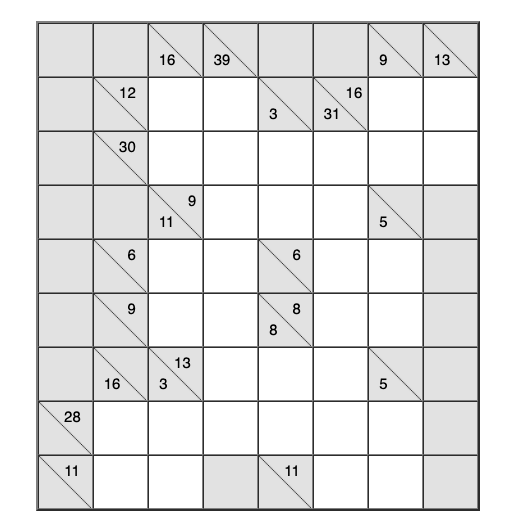

# Käyttöohje

Lataa tiedosto [kakuro.jar](https://github.com/lautanal/ot-harjoitustyo/releases/tag/viikko3)

## Ohjelman käynnistäminen

Ohjelma käynnistetään komennolla 

```
java -jar kakuro.jar
```

## Tekstikäyttöliittymä

Sovellus käynnistyy toistaiseksi tekstikäyttöliittymään:

Käyttäjä valitsee ensiksi pelattavan ruudukon.  Tällä hetkellä sovelluksessa on 10 ruudukkoa.  Ruudukot 1-5 ovat hieman helpompia kuin ruudukot 6-10.

	Syötä pelin numero, 1-10 (exit=x):
	> 10



Sovellus piirtää ruudukon tekstimuodossa.  Ruudukon sarakkeet on merkitty numeroilla ruudukon yläreunassa. Rivit on merkitty vastaavasti ruudukon vasemmassa reunassa.  Ruutu, johon voi asettaa numeron, on merkitty alaviivalla.

	  0  1  2  3  4  5  6  7  8  
	0 #  #  #  #  #  #  #  #  #  
	1 #  #  _  _  #  #  _  _  #  12 16 
	2 #  #  _  _  _  _  _  _  #  30 
	3 #  #  #  _  _  _  #  #  #  9  
	4 #  #  _  _  #  _  _  #  #  6  6  
	5 #  #  _  _  #  _  _  #  #  9  8  
	6 #  #  #  _  _  _  #  #  #  13 
	7 #  _  _  _  _  _  _  #  #  28 
	8 #  _  _  #  #  _  _  #  #  11 11 
	9 #  #  #  #  #  #  #  #  #  
	     16 16 39 3  31 9  13 
	        11    8     5     
	        3           5     

	Syötä ruutu (ij, i=rivi, j=sarake, exit=x):
	> 

Ruudukon oikealle puolelle on merkitty rivin numeroalueiden summat ja ruudukon alle vastaavasti sarakkeiden alueiden summat.

Käyttäjä määrittää ruudun kaksinumeroisella luvulla, esim. 82 , joista ensimmäinen numero tarkoittaa riviä 8 ja toinen saraketta 2.  Tämän jälkeen käyttäjä antaa numeron, joka siihen ruutuun laitetaan.

	Syötä ruutu (ij, i=rivi, j=sarake, exit=x):
	> 82
	Syötä ruutuun tuleva numero:
	> 2

	  0  1  2  3  4  5  6  7  8  
	0 #  #  #  #  #  #  #  #  #  
	1 #  #  _  _  #  #  _  _  #  12 16 
	2 #  #  _  _  _  _  _  _  #  30 
	3 #  #  #  _  _  _  #  #  #  9  
	4 #  #  _  _  #  _  _  #  #  6  6  
	5 #  #  _  _  #  _  _  #  #  9  8  
	6 #  #  #  _  _  _  #  #  #  13 
	7 #  _  _  _  _  _  _  #  #  28 
	8 #  _  2  #  #  _  _  #  #  11 11 
	9 #  #  #  #  #  #  #  #  #  
	     16 16 39 3  31 9  13 
	        11    8     5     
	        3           5     

Sovellus tarkastaa ruudukon jokaisen uuden numeron jälkeen ja kertoo, jos käyttäjän antama numero on virheellinen, esim. samassa rivissä on kaksi samaa numeroa tai rivin tai sarakkeen summa ei toteuta ehtoja.

	  0  1  2  3  4  5  6  7  8  
	0 #  #  #  #  #  #  #  #  #  
	1 #  #  _  _  #  #  _  _  #  12 16 
	2 #  #  _  _  _  _  _  _  #  30 
	3 #  #  #  _  _  _  #  #  #  9  
	4 #  #  _  _  #  _  _  #  #  6  6  
	5 #  #  _  _  #  _  _  #  #  9  8  
	6 #  #  #  _  _  _  #  #  #  13 
	7 #  _  _  _  _  _  _  #  #  28 
	8 #  8  2  #  #  _  _  #  #  11 11 
	9 #  #  #  #  #  #  #  #  #  
	     16 16 39 3  31 9  13 
	        11    8     5     
	        3           5     

	VIRHE, RIVISUMMA EI TÄSMÄÄ
	Syötä ruutu (ij, i=rivi, j=sarake, exit=x):
	> 


