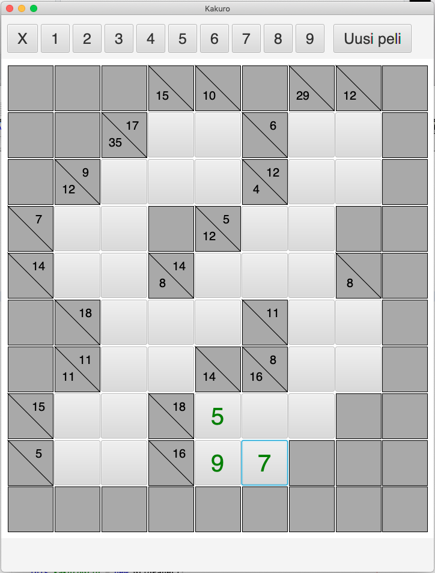

# Käyttöohje

Lataa tiedosto [kakuro.jar](https://github.com/lautanal/ot-harjoitustyo/releases/tag/Viikko5)

## Ohjelman käynnistäminen

Ohjelma käynnistetään komennolla 

```
java -jar kakuro.jar
```

## Tekstikäyttöliittymä

Sovellusta käytetään JavaFX:llä luodun käyttöliittymän avulla:



Kakuro-ruudukossa on tyhjiä ruutuja, joihin täytetään numeroita vaaka- ja pystysuoraan käyttäen numeroita 1-9.  Samassa kentässä vaaka- tai pystyrivillä ei ole kahta samaa numeroa. Vaaka- ja pystyrivien lukujen tulee toteuttaa summa, joka on merkitty ruudukkoon.

Sovellusikkunan alaosassa on ruudukko ja yläosassa on numeroiden valinta ja info-tekstin rivi.

Käyttäjä merkitsee jonkin ruudun hiirellä näpäyttämällä ja valitsee sen jälkeen kyseiseen ruutuun tulevan luvun.  Jos ruuruun valittu luku ei toteuta ruudun ehtoja (väärä summa tai sama luku kahdesti), saa käyttäjä ilmoituksen virheestä.


Kun käyttäjä saa ruudukon täytettyä oikein, hän saa sovellukselta onnittelut.


Sovelluksessa on tällä hetkellä 10 pientä ruudukkoa, joista valitaan satunnaisesti joku pelattavaksi.
