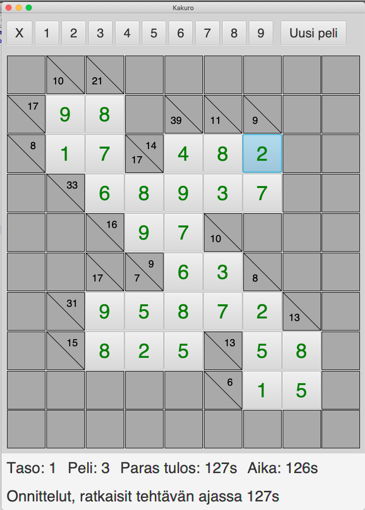

# Käyttöohje

Lataa sovellusen [release](https://github.com/lautanal/ot-harjoitustyo/releases/tag/loppupalautus).  Pelaamiseen tarvitset jar-tiedoston sekä puzzle-kansio, jossa on pelattavat ruudukot.

## Ohjelman käynnistäminen

Ohjelma käynnistetään komennolla 

```
java -jar kakuro.jar
```

## Käyttöliittymä

Sovellusta käytetään JavaFX:llä luodun käyttöliittymän avulla :


Kakuro-ruudukossa on tyhjiä ruutuja, jotka täytetään käyttäen numeroita 1-9.  Samassa kentässä vaaka- tai pystyrivillä ei saa olla kahta samaa numeroa. Vaaka- ja pystyrivien lukujen tulee toteuttaa summa, joka on merkitty ruudukkoon. 

Sovellusikkunan keskellä on varsinainen Kakuro-ruudukko.   Kakuro-ruudukon yläpuolella on numeroiden valintarivi.

Alhaalla on info-alue, jossa näkyvät ruudukon taso, numero, paras suoritus ja ratkaisuun kulunut aika.

## Pelin kulku

Käyttäjä valitsee jonkin Kakuro-ruudukon ruuduista hiirellä näpäyttämällä.   Sen jälkeen hän syöttää kyseiseen ruutuun sopivan luvun.  Luvun voi valita yläreunan numerorivistä tai painamalla näppäimistöltä.  

Jos ruutuun valittu luku ei toteuta ruudun ehtoja (väärä summa tai sama luku kahdesti), käyttäjä saa ilmoituksen virheestä.  Virheelliset numerot muuttuvat punaisiksi.  Virheellisen numeron saa poistettua painamalla X-nappia tai valitsemalla 0 näppäimistöltä.


## Pelin lopetus

Kun pelaaja saa ruudukon täyteen ja se on oikein ratkaistu, sovellus pysäyttää kellon ja onnittelee pelaajaa.  Sovellus tallettaa kunkin ruudukon parhaan tuloksen tiedostoon.

Sovelluksessa on tällä hetkellä 30 pientä ruudukkoa, jotka on jaettu kolmelle eri vaikeustasolle.  Pelaaja aloittaa tasolta 1, jossa valittavana on kymmenen eri peliruudukkoa.  Kun pelaaja on ratkaissut oikein kaikki tason kymmenen ruudukkoa, pääsee hän seuraavalle tasolle.

Painamalla 'Uusi peli' -nappia voi aloittaa seuraavan pelin. 




