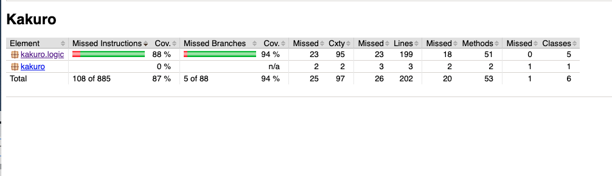

# Testausdokumentti

Ohjelmaa on testattu sekä automatisoiduin yksikkö- ja integraatiotestein JUnitilla sekä manuaalisesti pelaamalla kaikki rudukot läpi.

## Yksikkö- ja integraatiotestaus

### sovelluslogiikka

Automatisoitujen testien ytimen moudostavat sovelluslogiikkaa, eli pakkauksen [kakuro.logic](https://github.com/ot-harjoitustyo/src/main/java/kakuro/logic) luokkia testaavat integraatiotestit 

### Testauskattavuus

Käyttöliittymäkerrosta lukuunottamatta sovelluksen testauksen rivikattavuus on 87% ja haarautumakattavuus 94%

Testaamatta jäivät lähinnä käyttöliittymän (GameUi -luokka) kutsumat getterit.

## Järjestelmätestaus

Sovelluksen järjestelmätestaus on suoritettu manuaalisesti pelaamalla kaikki ruudukot läpi useampaan kertaan.

### Asennus ja konfigurointi

Sovellus on haettu ja sitä on testattu [käyttöohjeen](https://github.com/lautanal/ot-harjoitustyo//blob/master/dokumentaatio/kayttoohje.md) kuvaamalla tavalla sekä OSX- että Linux-ympäristössä.

Sovellusta on testattu sekä tilanteissa, joissa käyttäjät ja työt tallettavat tiedostot ovat olleet olemassa ja joissa niitä ei ole ollut jolloin ohjelma on luonut ne itse.

### Toiminnallisuudet

Kaikki [vaatimusmäärittelydokumentin](https://github.com/lautanal/ot-harjoitustyo/blob/master/dokumentaatio/vaatimusmaarittely.md) ja käyttöohjeen listaamat toiminnallisuudet on käyty läpi.
