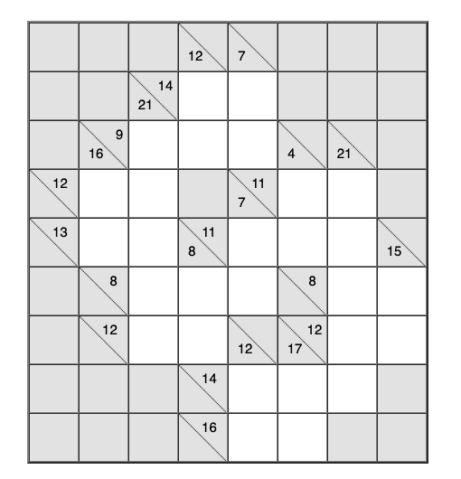

# Vaatimusmäärittely

## Sovelluksen tarkoitus

Sovellus on japanilainen Kakuro-numeroristikko.  Ruudukossa on tyhjiä ruutuja, joihin täytetään numeroita vaaka- ja pystysuoraan käyttäen numeroita 1-9, siten, että samalla vaaka- tai pystyrivillä ei ole kahta samaa numeroa.  Vaakarivin vasemmalla puolella ja pystyrivin yläpuolella on merkitty summa, joka rivin lukujen tulee toteuttaa.

## Käyttäjät

Sovelluksella on alkuvaiheessa vain yksi käyttäjä eli pelaaja.  Myöhemmin voidaan lisätä admin-käyttäjä, joka voi tehdä esimerkiksi uusia ruudukoita.

## Käyttöliittymäluonnos

Sovellus koostuu yhdestä näkymästä eli pelilaudasta.

Käyttö on suoraviivaista.  Käyttäjä valitsee ruudun ja antaa haluamansa numeron, joka ruutuun laitetaan. Jos käyttäjän antama numero ei toteuta ruudun ehtoja, numero muuttuu punaiseksi. Kun ruudukko on täynnä, käyttäjä näkee kulutetun ajan ja saa onnittelut.

## Perusversion tarjoama toiminnallisuus

Käyttäjä voi pelata Kakuroa etukäteen tehdyillä kentillä.  Kenttiä on eri tasoisia.

## Jatkokehitysideoita

Perusversion jälkeen järjestelmää täydennetään ajan salliessa esim. seuraavilla toiminnallisuuksilla

- Käyttäjien rekisteröinti
- Suorituksen nopeutta voidaan mitata ja ennätykset tallettaa käyttäjäkohtaisesti
- Voidaan tehdä tasoja, jonka tehtävät pitää suorittaa, jotta pääsee seuraavalle tasolle
- Käyttäjä voi merkitä ruutuun muistiin mahdolliset numerovaihtoehdot
- Kenttien automaattinen generointi
- Ruudukon automaattinen ratkaisu
